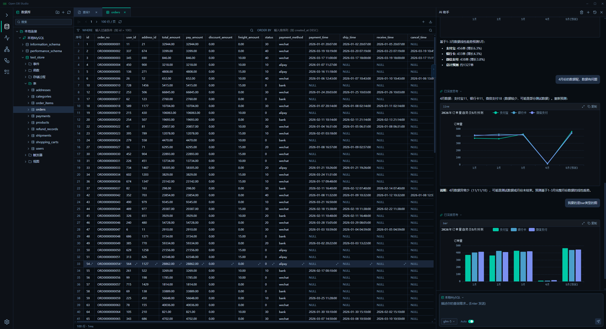

<div align="center">

# 🗄️ Open DB Studio

**本地优先的 AI 数据库 IDE**

_连接数据源 · 自然语言转 SQL · 执行查询 · 可视化结果 · 全程本地运行_

[]()
[]()
[]()
[]()
[]()



</div>

---

## ✨ 核心亮点

- 🤖 **AI Agent 驱动** — 自然语言转 SQL、AI 建表、SQL 优化、错误自动诊断
- 🔌 **多数据源支持** — MySQL、PostgreSQL、Oracle、SQL Server、SQLite 等 8 种数据库
- 🔒 **本地优先 & 安全** — 所有数据留在本地，密码 AES-256-GCM 加密，API Key 永不暴露前端
- 📊 **内联图表渲染** — AI 回答中直接生成 ECharts 交互图表，数据即时可视化
- 🧠 **GraphRAG 知识图谱** — Schema 实体图 + JOIN 路径自动推断，让 AI 真正理解数据库结构
- 🌊 **流式思考模型** — 支持 DeepSeek-R1 等推理模型，流式输出思考过程
- 📝 **专业 SQL 编辑器** — Monaco 编辑器、Schema-aware 自动补全、一键格式化、多结果集 Tab
- 🚀 **开箱即用** — 基于 Tauri 2.x，跨平台桌面应用，无需额外服务

---

## 🔌 数据库支持

| 数据库 | 版本 | 状态 |
|--------|------|------|
| MySQL | 5.7 / 8.x | ✅ 完整支持 |
| PostgreSQL | 12+ | ✅ 完整支持 |
| Oracle | 11g+ | ✅ 支持 |
| SQL Server | 2017+ | ✅ 支持 |
| SQLite | 3.x | ✅ 支持 |
| Apache Doris | 1.2+ | ✅ 支持 |
| ClickHouse | 22+ | ✅ 支持 |
| TiDB | 6.0+ | ✅ 支持 |

> 完整兼容性矩阵见 [docs/database-compatibility.md](./docs/database-compatibility.md)

---

## 🚀 快速开始

### 环境要求
- [Node.js](https://nodejs.org/) 18+
- [Rust](https://rustup.rs/) stable

### 安装运行

```bash
# 克隆仓库
git clone https://github.com/your-org/open-db-studio.git
cd open-db-studio

# 安装依赖
npm install

# 开发模式
npm run tauri:dev

# 生产构建
npm run tauri:build
```

### AI 配置
启动后进入 **设置 → AI 模型配置**，添加 OpenAI 兼容接口（OpenAI、DeepSeek、Qwen 等）。

---

## 📚 模块导航

| 模块 | 功能简介 | 文档 |
|------|---------|------|
| 🔌 [连接管理](./docs/modules/connection-management.md) | 多数据源连接、分组管理、SSL/TLS、连接池缓存 | [详细文档](./docs/modules/connection-management.md) |
| 📝 [SQL 编辑器](./docs/modules/sql-editor.md) | Monaco 编辑器、多结果集 Tab、Schema 补全、格式化、Ghost Text | [详细文档](./docs/modules/sql-editor.md) |
| 🤖 [AI 助手](./docs/modules/ai-assistant.md) | Text-to-SQL、AI 建表、错误诊断、多会话、流式思考模型、Slash 命令 | [详细文档](./docs/modules/ai-assistant.md) |
| 🏗️ [ER 设计器](./docs/modules/er-designer.md) | 可视化建表、关系连线、DDL 预览、双向同步、多项目管理 | [详细文档](./docs/modules/er-designer.md) |
| 🧠 [知识图谱](./docs/modules/knowledge-graph.md) | Schema 实体图、JOIN 路径推断、Palantir Link Node 风格 | [详细文档](./docs/modules/knowledge-graph.md) |
| 📊 [业务指标层](./docs/modules/metrics.md) | 指标定义、AI 生成草稿、审核确认、指标检索增强 | [详细文档](./docs/modules/metrics.md) |
| 📦 [数据导入导出](./docs/modules/import-export.md) | CSV/JSON/Excel 导入、字段映射、多格式导出、Task 进度跟踪 | [详细文档](./docs/modules/import-export.md) |
| 🧭 [ActivityBar 导航](./docs/modules/activity-bar.md) | VSCode 风格侧边栏、DB/指标/图谱模式切换、设置入口 | [详细文档](./docs/modules/activity-bar.md) |

---

## 🛠️ 技术栈

| 层级 | 技术 |
|------|------|
| 桌面框架 | Tauri 2.x |
| 前端 | React 18 + TypeScript + Vite |
| 状态管理 | Zustand |
| SQL 编辑器 | Monaco Editor |
| 图表 | ECharts |
| Rust 后端 | Tokio + rusqlite |
| AI 接入 | OpenAI 兼容接口（统一代理）|
| Agent 引擎 | OpenCode |

---

## 🗺️ 路线图

| 阶段 | 目标 | 状态 |
|------|------|------|
| MVP | 连接管理、SQL 执行、基础 AI | ✅ 完成 |
| V1 | 完整 DB 管理、AI 建表/优化/诊断、数据导入导出 | ✅ 完成 |
| V2 | GraphRAG、业务指标层、跨数据源迁移、流式思考模型 | ✅ 完成 |
| V3 | 向量库、插件系统、团队协作 | 🔜 规划中 |

---

## 🙏 致谢

本项目集成了 [OpenCode](https://github.com/sst/opencode) 作为 AI Agent 底座引擎。

## 🤝 贡献

欢迎提交 Issue 和 Pull Request！

## 📄 License

[MIT License](./LICENSE)
